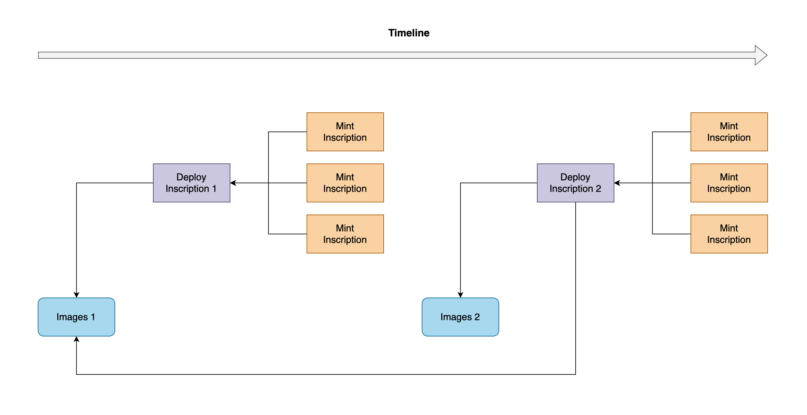
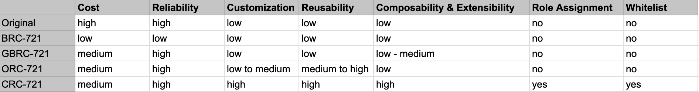
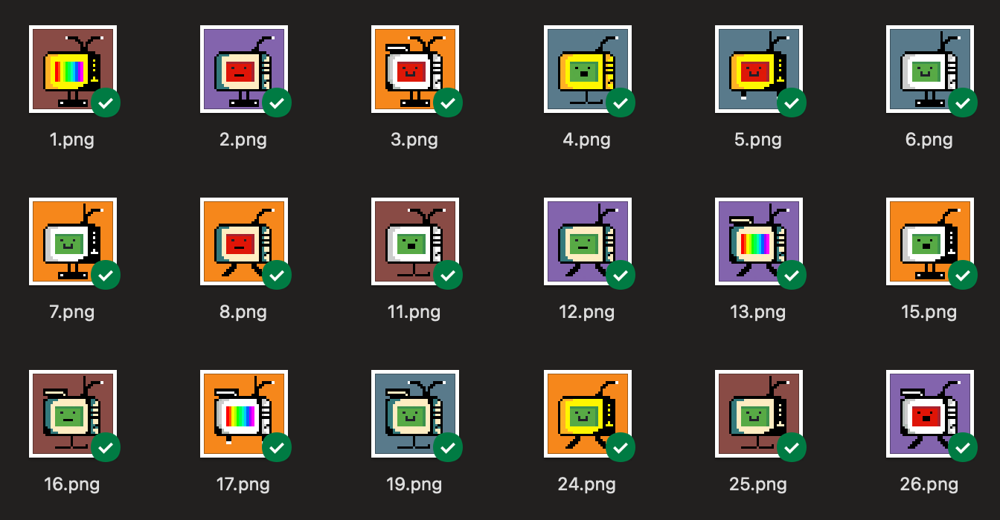
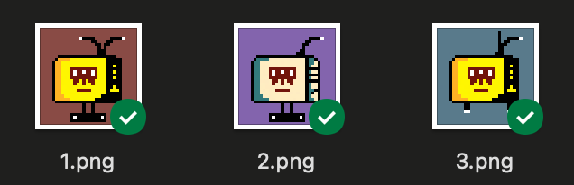
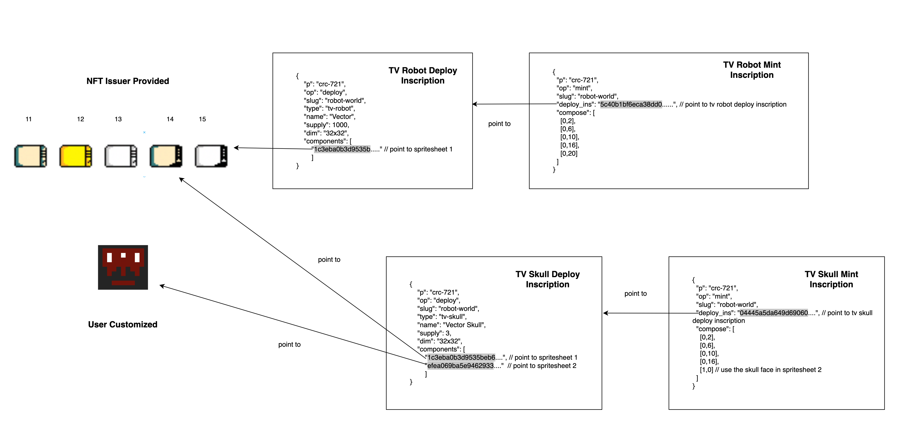

# Composable BRC-721 (CRC-721)

> The **Composable BRC-721 (CRC-721)** standard proposed in this document aims to bring the following capabilities to the Ordinal NFT ecosystem:
> * Composability
> * Extensibility
> * Heightened Customization
> * User-Driven Artwork Creation
> * Enable Role Assignment within Collections
> * Reusability of Creative Materials
> * Streamlined On-Chain Transaction Costs

# Contact

Comment, Review, Suggestions, Know more about the protocl: Pls Join Discord: https://discord.gg/PQB2P3guPW
Twitter: @kelvinaddr

# Background

With the support of the Ordinal Theory, we are allowed to mint NFTs on the Bitcoin Chain. However, due to frequent transaction activities, on-chain transaction costs have been gradually increasing. The BRC-721 protocol proposes storing the images off-chain and referencing them through URLs on third-party platforms. However, this approach has the drawback of relying on the availability of the third-party platforms.

To address this issue, GBRC-721 suggests storing the components of the images on-chain and recording how these components are assembled into a complete image during the minting process. This significantly reduces the transaction fees involved in the minting process. Building upon GBRC-721, ORC-721 adopts a more concise JSON format, reducing the size of the JSON file and further lowering transaction costs.

However, the aforementioned protocol still faces the following issues:

## Limited Composability & Extensibility

The GBRC-721 and ORC-721 protocols still exhibit limitations in terms of composability:

GBRC-721: The Deploy-Inscription file in GBRC-721 contains the image information, which restricts the ability to reference these image details in another Deploy-Inscription. Additionally, once the deployment is completed, it becomes impossible to add new image assets.

ORC-721: In ORC-721, the image information is extracted into a single file, allowing multiple Deploy-Inscriptions to reference the same image data. This enables the reuse of these images in different Deploy-Inscriptions, as exemplified by the deployment of DiyPunk1 and DiyPunk2.

Despite this improvement, ORC-721 still suffers from limited composability since it can only reference a single set of image information. Consequently, once the deployment is finalized, it remains impossible to add new image assets.

To address these limitations, the proposed CRC-721 protocol will enhance the existing standards and provide a higher degree of composability, offering greater flexibility for innovative applications involving other NFTs.

## Inability of Role Assignment within Collections

Both GBRC-721 and ORC-721 lack the ability to extend roles. This means that within a collection, only one role can be assigned. However, with the highly flexible composability provided by the CRC-721 protocol, this requirement becomes achievable. In the following example, we will attempt to create a "Robot World" where various robots of different models and styles are members of the "Robot World" collection. Each robot plays a distinct role, possessing unique appearances, abilities, and personalities.

## Limited Degree of Customization

In GBRC-721, customization is not possible as both the image assets and the JSON used for minting the NFT are provided by the NFT issuer. Users are limited to selecting from the predetermined minting JSON options. 

On the other hand, ORC-721 offers a lower degree of customization. The key difference is that the minting JSON is not provided by the NFT issuer but constructed by the users themselves. As long as this JSON falls within the defined range, it is considered valid. However, it's important to note that the image assets are still fixed once the Deploy-Inscription is confirmed on the chain, and you cannot add new image materials for expansion and customization.

CRC-721 allows for a higher degree of customization where both the image assets and the minting JSON can be customized by the users. As long as the values fall within the defined range, they are considered valid.

## User-Driven Artwork Creation

As mentioned above, the increased level of customization in CRC-721 empowers users to exercise their creativities. Consequently, a greater extent of creative ownership is delegated to the users.

## Reusability of Creative Materials

CRC-721 enhances the reusability of image assets by separating them from the Deploy-Inscription. This allows multiple Deploy-Inscriptions to reference the same or multiple sets of image assets.

# CRC-721 Protocol

The CRC-721 protocol consists of three main components:

* Image Assets 
* Deploy Inscription
* Mint Inscription

## Image Assets

Image assets are encoded in spritesheets. Here is an example: [Spritesheet 1](https://ordinals.com/content/1c3eba0b3d9535beb691dd3454a472647cce9dadcc80cf6f6321633e372451cci0)


## Deploy-Inscription

Below is an example of a Deploy-Inscription. Compared to GBRC-721, there are additional fields introduced: `type`, `wl`, and `components`. The removed information includes `trait_types` and `traits` since this information is now included within the image assets. CRC-721 utilizes the `components` field to reference one or more image assets.

The `components` field allows for multiple Deploy-Inscriptions to reference the same image assets, increasing the reusability of image materials. Furthermore, by deploying multiple Deploy-Inscriptions and introducing new assets each time, the composability is expanded. By indirectly referring to image materials inscribed earlier, CRC-721 enables extensibility of NFT creation. This operates in a similar manner to Git, where image assets are akin to new commits, and Deploy-Inscriptions act as tags. You will observe a tree-like referencing structure similar to the diagram below:


The `type` field is optional and can be used to assign roles within the collection. Each Deploy-Inscription can assign a new role by specifying the `type`. The number of roles can also be controlled.

```json
{
    "p": "crc-721",
    "op": "deploy",
    "slug": "robot-world",
    "type": "tv-robot",
    "name": "Vector",
    "supply": 1000,
    "dim": "32x32",
    "components": [
        "1c3eba0b3d9535beb691dd3454a472647cce9dadcc80cf6f6321633e372451cci0",
        "efea069ba5e946293341a4d36cf88e45be0b25380c7b00b1066b7ef5656aa0bbi0"
        ]
}
```

| Key    | Required | Descriptions |
| ------ | ----------- | --------- |
| p      |    Yes   | Protocol identifier |
| op     |    Yes   | Operation: (Deploy, Mint) 
| slug   |    Yes   | Slug: Collection Identifier, like domain name |
| dim    |    Yes   | Dimensions: eg. 32x32 |
| name   |    No    | Name: Human readable name of collection | 
| type   |    No    | Type: Type of this subset. Can use it to indicate to role of NFT | 
| supply |    No    | Supply: Supply of this subset |
| components |  Yes | Components: Inscription IDs of image material |


## Mint Inscription

The Mint-Inscription describes how the image assets are stacked and recreated to form the final image. 

```json
{
    "p": "crc-721",
    "op": "mint",
    "slug": "robot-world",
    "hash": "f5be8929191cac129e8440df6c10c1be",
    "deploy_ins": "5c40b1bf6eca38ddeeed8b211d50232959706d63c9aded440fd54369162ffcbei0",
    "compose": [
        [0,2],
        [0,6],
        [0,10],
        [0,16],
        [1,0]
    ]
}
```

The `deploy_ins` field points to a specific Deploy-Inscription. If this Deploy-Inscription has been assigned a role, the NFT being minted will be considered a member of that role.

The `compose` field specifies how the rendering and composition of the final image are performed. The execution order is from top to bottom. For example, `[0, 2]` will be rendered first, followed by `[0, 6]`, and so on. Taking `[0, 2]` as an example, the 0 refers to the first image asset set. And the 6 refers to the component at index 6 within the first image asset set. 

This can be seen as an indirect pointer. The first step involves retrieving the Deploy-Inscription using `5c40b1bf6eca38ddeeed8b211d50232959706d63c9aded440fd54369162ffcbei0` from `deploy_ins`. Then, within the Deploy-Inscription, there are two sets of image assets:

```json
"components": [
    "1c3eba0b3d9535beb691dd3454a472647cce9dadcc80cf6f6321633e372451cci0", // This points to image asset set 1
    "efea069ba5e946293341a4d36cf88e45be0b25380c7b00b1066b7ef5656aa0bbi0"  // This points to image asset set 2
    ]
```

By using the inscription ID, we can locate the image asset set and access its contents. This allows us to retrieve the desired component from the asset set, enabling us to manipulate and incorporate it into the composition process.


| Key    | Required | Descriptions |
| ------ | ----------- | --------- |
| p      |    Yes   | Protocol identifier |
| op     |    Yes   | Operation: (Deploy, Mint) |
| slug   |    Yes   | Slug: Collection Identifier, like domain name |
| deploy_ins |  Yes | Deploy Inscription ID |
| compose |   Yes   | Compose: for recreating image |
| hash   |    No    | Hash: This refers to the SHA256 output of the generated image. |

In the end, we will obtain a network of relationships as depicted in the diagram below:



# Comparison



Comparing the five BRC-721 protocols, we can observe that CRC-721 stands out in terms of cost, reliability, reusability, composability, and role assignment. It offers significant advantages over the other protocols in these areas.

# Case Study

To demonstrate the composability, reusability, customization, and other advantages of CRC-721, we are conducting the first demo called "Robot World." Robot World is a planet populated exclusively by robots. These robots possess various roles, appearances, abilities, and personalities. The first deployment in this demo is the "TV Robot" with a supply of 1000, and they are named "Vector." 

## Prepare TV Robot Image Assets

Deploy spritesheet: [Spritesheet 1](https://ordinals.com/content/1c3eba0b3d9535beb691dd3454a472647cce9dadcc80cf6f6321633e372451cci0)

By numbering the components in the spritesheet, we construct a valid value range json for each type of component. 

```json
{
    "background": [
        [0, "Bitcoin Orange"], // [index, "Descripton"]
        [1, "Blue"],
        [2, "Brown"],
        [3, "Purple"],
    ],
    "antenna": [
        [4, "Antenna 1"],
        [5, "Antenna 2"],
        [6, "Antenna 3"],
    ],
    "stand": [
        [7, "Stand 1"],
        [8, "Stand 2"],
        [9, "Stand 3"],
        [10, "Stand 4"],
    ],
    "body": [
        [11, "Body-1-Blue"],
        [12, "Body-1-Gold"],
        [13, "Body-1-White"],
        [14, "Body-2-Blue"],
        [15, "Body-2-White"],
        [16, "Body-2-Gold"],
        [17, "Body-3-White"],
        [18, "Body-3-Blue"],
        [19, "Body-3-Gold"],
        
    ],
    "face": [
        [20, "Face-Rainbow"],
        [21, "Face-Smile-Red"],
        [22, "Face-Smile-Green"],
        [23, "Face-Suprise-Red"],
        [24, "Face-Suprise-Green"],
        [25, "Face-Normal-Red"],
        [26, "Face-Normal-Green"],
        [27, "Face-Chessboard"],
    ]
}
```

The rendering order should be: `"background" -> "antenna" -> "stand" -> "body" -> "face"`.

## Deploy TV Robot
Here is the Deploy-Inscription for "Vector":

[TV Robot Deploy Inscription](https://ordinals.com/inscription/5c40b1bf6eca38ddeeed8b211d50232959706d63c9aded440fd54369162ffcbei0)

This is the TV Robot Deploy Json:
```json
{
    "p": "crc-721",
    "op": "deploy",
    "slug": "robot-world",
    "type": "tv-robot",
    "name": "Vector",
    "supply": 1000,
    "dim": "32x32",
    "components": [
        "1c3eba0b3d9535beb691dd3454a472647cce9dadcc80cf6f6321633e372451cci0" // point to spritesheet 1
        ]
}
```

## Mint TV Robot
[TV Robot Mint Inscription](https://ordinals.com/inscription/874deb2e87fc6bb23973fe35080010325f06c99d5f8d053db5a508111c37ed9ei0)

This is an example TV Robot Mint Inscription:
```json
{
  "p": "crc-721",
  "op": "mint",
  "slug": "robot-world",
  "deploy_ins": "5c40b1bf6eca38ddeeed8b211d50232959706d63c9aded440fd54369162ffcbei0", // point to tv robot deploy inscription
  "compose": [
    [0,2],
    [0,6],
    [0,10],
    [0,16],
    [0,20]
  ]
}
```



## Prepare TV Skull Image Assets

TV Skull is a character that's extended from TV Robot, so we need to inscribe the specific attributes of TV Skull.


Deploy spritesheet: [Spritesheet 2](https://ordinals.com/content/efea069ba5e946293341a4d36cf88e45be0b25380c7b00b1066b7ef5656aa0bbi0)

## Deploy TV Skull
Deploy a "TV Skull" based on "TV Robot", which reuse most of the image assets of "TV Robot".

[TV Skull Deploy Inscription](https://ordinals.com/content/04445a5da649d6906073537fdecdcd2a03050b1b02a9db4c450dc4dfd395d7a3i0)

This is the TV Skull Deploy Json:
```json
{
    "p": "crc-721",
    "op": "deploy",
    "slug": "robot-world",
    "type": "tv-skull",
    "name": "Vector Skull",
    "supply": 3,
    "dim": "32x32",
    "components": [
        "1c3eba0b3d9535beb691dd3454a472647cce9dadcc80cf6f6321633e372451cci0", // point to spritesheet 1
        "efea069ba5e946293341a4d36cf88e45be0b25380c7b00b1066b7ef5656aa0bbi0"  // point to spritesheet 2
        ]
}
```


## Mint TV Skull

[TV Skull Mint Inscription](https://ordinals.com/content/8e001f138d92bce7f0affad915defaa828aab83db04665f90f02dff2627a81e3i0)

Mint TV Skull Json:
```json
{
  "p": "crc-721",
  "op": "mint",
  "slug": "robot-world",
  "deploy_ins": "04445a5da649d6906073537fdecdcd2a03050b1b02a9db4c450dc4dfd395d7a3i0", // point to tv skull deploy inscription
  "compose": [
    [0,2],
    [0,6],
    [0,10],
    [0,16],
    [1,0] // use the skull face in spritesheet 2
  ]
}
```




The following diagram depict the overall relationship among the inscriptions described above.




# Create Your Own Character in the Robot World

CRC-721 is highly composable and extensible. We warmly welcome you to deploy more characters to Robot World and create a vast Robot Universe on the Bitcoin chain.

Currently, two Robot World characters have already been deployed:

1. **TV Robot**
2. **TV Skull**

By leveraging the power of CRC-721, you can continue expanding the Robot World by introducing new roles, unique traits, and diverse attributes to each character. This will enable the creation of a dynamic and immersive Robot Universe that offers endless possibilities for collectors, creators, and enthusiasts. Let your imagination soar as you contribute to the growth and evolution of this exciting digital ecosystem.

# Frontend Rendering

```
// todo
```
